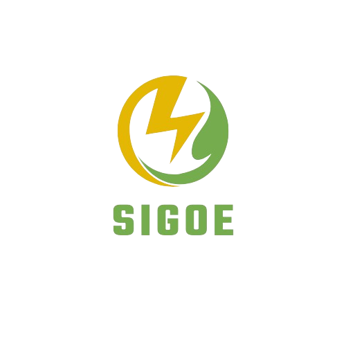
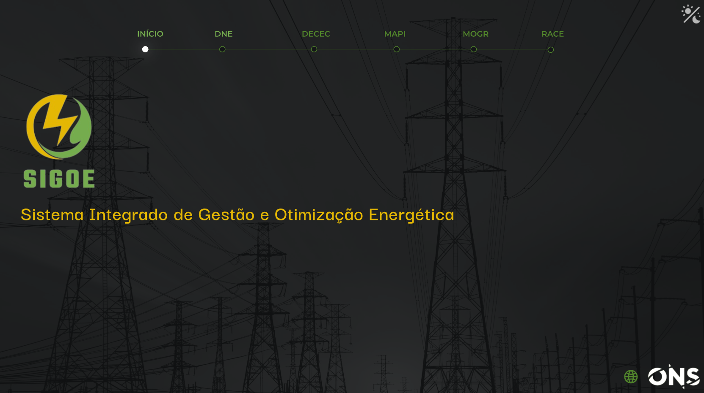

# DATATHON ONS - Sistema Integrado de Gestão e Otimização Energética (SIGOE)

Este projeto foi desenvolvido como parte de um desafio inovador, o DATATHON, promovido pela Operador Nacional do Sistema Elétrico (ONS). O objetivo do desafio é incentivar a criação de soluções inovadoras para a gestão e otimização energética no Brasil, utilizando tecnologias avançadas e análise de dados.

---

## :zap: Sistema Integrado de Gestão e Otimização Energética (SIGOE)

O SIGOE é uma plataforma avançada destinada a revolucionar o gerenciamento e a otimização do uso de energia no Brasil. Utilizando tecnologias de ponta em análise de dados e inteligência artificial, o SIGOE visa proporcionar uma gestão energética mais eficiente, sustentável e resiliente.

---

### :bar_chart: Componentes do SIGOE

O sistema é composto por diversos módulos integrados, cada um focado em aspectos específicos da gestão energética:

   

#### :globe_with_meridians: Dashboard Nacional de Energia (DNE)

- **Funcionalidade:** Integração dos dados da ONS com análises avançadas para monitoramento em tempo real da demanda, geração e distribuição de energia em nível nacional.
- **Tecnologia:** API's das bases de dados da ONS ou conexão com fontes de dados que promovam a atualização em tempo real.

<b>Sugestões de Gráficos e Estrutura:</b>

   
  
- **Mapa Interativo:** Exibe a distribuição geográfica da demanda de energia e da geração de MMGD, com a capacidade de zoom para visualizar informações em nível nacional, estadual ou regional.
- **Gráficos em Tempo Real:** Mostra a geração de energia atual versus a demanda em tempo real, com gráficos de linha, barra ou área atualizados dinamicamente.
- **Indicadores de Desempenho:** Utiliza KPIs (Key Performance Indicators) para monitorar métricas como eficiência energética, custos de geração, e participação de fontes renováveis.- Indicadores de Desempenho
- **Alertas de Sistema:** Notificações automáticas para condições críticas como sobrecarga da rede, falhas, ou desvios significativos na previsão.
- **Controles Deslizantes para Simulação:** Permite aos usuários ajustar variáveis como demanda esperada ou disponibilidade de geração para simular diferentes cenários operacionais.

**Próximos Passos:** Integração dos Dados da ONS, atualizados e de forma que atualize em tempo real. Atualização e Criação dos Gráficos propostos.

   

#### :partly_sunny: Dashboard Estadual de Condições Climáticas e Energéticas (DECEC)

- **Funcionalidade:** Agregação de dados climáticos por estado para previsão da geração de energias renováveis, com visualizações por região.
- **Tecnologia:** Uso de APIs climáticas e integração com modelos de previsão de tempo.

<b>Sugestões de Gráficos e Estrutura:</b>

   
  
- **Painéis Meteorológicos:** Integrados com APIs climáticas para fornecer dados atualizados sobre temperatura, vento, radiância solar e previsões do tempo.
- **Filtros Personalizados:** Possibilita a seleção de estados específicos para visualizar dados de carga, geração e previsão meteorológica detalhados.
- **Análise Histórica:** Gráficos e tabelas que permitem a análise de tendências históricas e a comparação com dados atuais.
- **Visão de Recursos Renováveis:** Informações sobre a capacidade instalada e atual geração de usinas solares, eólicas, e outras fontes renováveis por estado.

**Próximos Passos:** Integração com os dados climáticos e análises com os demais dados da ONS. Criação dos Gráficos e análises propostas.

   

#### :brain: Dashboard Módulo de Análise e Previsão Inteligente (MAPI)

- **Funcionalidade:** Utiliza algoritmos de machine learning, como redes neurais e LSTM, para prever a demanda de energia com alta confiabilidade.
- **Tecnologia:** Algoritmos treinados com grandes conjuntos de dados históricos e atuais, ajustando-se dinamicamente a padrões emergentes.

<b>Sugestões de Gráficos e Estrutura:</b>

   
  
- **Visualização de Previsões de Demanda:** Gráficos preditivos mostrando a demanda futura com intervalos de confiança, permitindo aos operadores visualizar cenários prováveis.
- **Comparativos de Previsão vs. Real:** Janelas que comparam previsões de demanda com os dados reais conforme são coletados, destacando a precisão do modelo.
- **Validação de Modelo:** Seção para análise de desempenho dos modelos preditivos com métricas como RMSE (Root Mean Square Error) e MAPE (Mean Absolute Percentage Error).
- **Heatmaps de Erro de Previsão:** Mapas de calor que indicam onde e quando as previsões estão se desviando significativamente da realidade, para ajustes rápidos nos modelos.

**Próximos Passos:** Integração com os dados relativos aos modelos de previsão. Criação dos Gráficos e análises estatísticas.

   

#### :sun_behind_small_cloud: Dashboard Módulo de Otimização de Geração Renovável (MOGR)

- **Funcionalidade:** Otimiza a geração de energia baseada em fontes renováveis com base em previsões meteorológicas e padrões de consumo.
- **Tecnologia:** Programação linear e otimização mista inteira para a alocação eficiente de recursos de geração.

<b>Sugestões de Gráficos e Estrutura:</b>

   
  
- **Painel de Controle de Geração:** Controles e indicadores para ajustar a geração de energia renovável em resposta a previsões e condições atuais.
- **Otimização de Portfólio de Energia:** Visualizações que mostram como a geração de energia é otimizada entre diferentes fontes, com base em custo, disponibilidade e demanda.
- **Análise de Cenário:** Ferramentas para criar e visualizar cenários de otimização, permitindo aos operadores explorar o impacto de diferentes estratégias de alocação.

**Próximos Passos:** Integração com os dados das fontes renováveis e análises com os demais dados da ONS. Criação dos Gráficos e análises propostas.

   

#### :wind_face: Dashboard Rede Adaptativa de Compartilhamento Energético (RACE)

- **Funcionalidade:** Divide regiões de alta incidência solar ou eólica e estabelece unidades compartilhadas de distribuição de energia, ajustando a alocação de energia entre regiões conforme a necessidade.
- **Tecnologia:** Sistemas de gestão de rede avançados que permitem o fluxo bidirecional de energia e o uso de micro-redes.

<b>Sugestões de Gráficos e Estrutura:</b>

   
  
- **Mapa de Fluxo de Energia:** Uma representação visual do fluxo de energia entre regiões, mostrando como a energia é compartilhada em resposta à demanda.
- **Indicadores de Eficiência de Distribuição:** Métricas que rastreiam a eficiência com que a energia é distribuída da geração para o consumo.
- **Gráficos de Micro-Redes:** Visualizações detalhadas das micro-redes, incluindo geração, armazenamento e consumo local.

**Próximos Passos:** Integração com os dados das micro-redes e análises com os demais dados da ONS. Criação dos Gráficos e análises propostas.

---

   

## :bulb: Apresentação do Protótipo

   

> ### Impacto

O SIGOE é uma plataforma integrada que representa a próxima geração de gerenciamento de energia, combinando previsão de demanda avançada, otimização de recursos e compartilhamento inteligente de energia.

> ### Inovação

Incorpora IA e análise de dados para uma gestão energética mais inteligente, adaptativa e responsiva, garantindo a estabilidade do SIN e promovendo a sustentabilidade.

> ### Flexibilidade

Ajusta automaticamente as estratégias de geração e distribuição em resposta a eventos climáticos, demanda flutuante e disponibilidade de recursos renováveis.

> ### Resiliência

Aumenta a capacidade do SIN de responder a eventos inesperados e flutuações de demanda.

---

   

## :scroll: Conclusão

Este protótipo visa não apenas melhorar a eficiência e confiabilidade do SIN, mas também apoiar a transição para uma matriz energética mais sustentável e resiliente. Ele proporciona uma solução abrangente que é tanto proativa quanto reativa, capaz de antecipar necessidades futuras e responder a mudanças em tempo real.

A implementação do SIGOE destacaria principalmente a Integração dos Setores da ONS, enfatizando na cultura da empresa a importância do uso de tecnologias avançadas para a gestão eficiente dos recursos energéticos. Ao integrar análises preditivas e mecanismos de otimização, o sistema não apenas melhora a eficiência operacional.

[Conheça o **SIGOE**](https://app.powerbi.com/view?r=eyJrIjoiZjBjNDYyMWItZDljYi00MzRhLWJlNTctMzBmYWYzOTYxMjczIiwidCI6ImJkMWMxZTAzLTU2MDMtNDUzNy04ODY5LWQ5ZGQyYzRiMjc2MiJ9&pageName=ReportSection)

